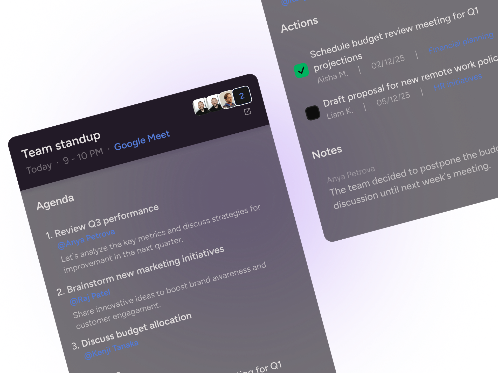

# Alhussein Aldali — Portfolio

A **Flutter** personal site that presents experience, shipped work, interactive UI snippets, and contact links with a cohesive **neon / glass** aesthetic. It targets **Flutter Web** first and runs on desktop and mobile shells as a normal Flutter app.

<p align="center">
  
  <br />
  <em>Hero GIF from the Home section (bundled asset).</em>
</p>

---

## What it is for

- **Professional presence**: One place for recruiters and collaborators to skim your background (**About**), case studies (**Projects**), and how to reach you (**Contact**).
- **Proof of craft**: **Widget explore** embeds real UI (including a vendored [`image_loader`](packages/image_loader) demo) instead of placeholder boxes.
- **Light engagement**: **Neon Memory Lab** (`/lab`) is a small interactive extra on top of the core portfolio story.

---

## What is implemented

| Area | What you get |
|------|----------------|
| **Home** (`/`) | Hero copy, GIF, social CTAs wired through Riverpod-backed content. |
| **About** (`/about`) | Sections with timeline-style experience and illustrative banners (`assets/images/about/`). |
| **Projects** (`/projects`) | Cards in **two columns** on wider viewports (height-balanced split). Store listings (**Google Play** / **App Store**) show **screenshot carousels** from official CDN URLs. Site-only rows (**Humani**) use a **bundled PNG** banner (avoids browser CORS on remote art). Repo-only rows (**Handover**, **Portfolio**) use **GitHub Open Graph** banners or bundled assets where needed. Primary actions open the real URLs (Play, App Store, site, repo). |
| **Widget explore** (`/widgets`) | Gallery cards; **Image loader** is first with a taller live preview (`RandomImageScreen` via local `packages/image_loader`). |
| **Neon Memory Lab** (`/lab`) | Experimental neon “memory” page. |
| **Contact** (`/contact`) | Links and bundled CV PDF open/download flow. |

**Stack**: Flutter **3.x**, **Dart ^3.9**, **Riverpod**, **GoRouter**, **google_fonts**, **url_launcher**. Local package **`image_loader`** under [`packages/image_loader`](packages/image_loader/).

---

## Repository layout (high level)

```text
lib/
  app/                 # PortfolioApp, theme hooks
  core/                # Router, breakpoints, colors, AssetPaths
  features/
    home/              # Landing hero
    about/             # Profile + experience
    projects/          # Project cards + store/site imagery
    widget_explore/    # Demo gallery + image_loader embed
    lab_void/          # Neon Memory Lab
    contact/           # Links + CV
packages/
  image_loader/        # Vendored random-image / FancyLogoLoader demo
assets/
  images/              # Hero, About banners, Projects art, Humani PNG, …
  cv/                  # CV PDF for Contact
```

---

## Screenshots (bundled assets)

These render on GitHub from paths in this repo (no screenshot runner required):

<p align="center">
  
  <br />
  <em>Humani row: bundled feature art (<code>assets/images/projects/humani_feature_2.png</code>).</em>
</p>

<p align="center">
  
  <br />
  <em>Optional header art used in the Projects feature set.</em>
</p>

> **Tip**: After updating UI, regenerate marketing screenshots by capturing the browser or device and optionally replace or add files under `assets/images/` and reference them here.

---

## Run locally

```bash
# From repo root (use FVM if you use it)
flutter pub get
flutter run -d chrome
```

Other targets: `flutter devices` then `flutter run -d <device_id>`.

**Tests**

```bash
flutter test
```

---

## Updating content

- **Projects**: edit [`lib/features/projects/data/repositories/projects_repository_impl.dart`](lib/features/projects/data/repositories/projects_repository_impl.dart).
- **Widget demos**: [`lib/features/widget_explore/data/repositories/widget_explore_repository_impl.dart`](lib/features/widget_explore/data/repositories/widget_explore_repository_impl.dart) plus previews in [`widget_explore_page.dart`](lib/features/widget_explore/presentation/pages/widget_explore_page.dart).
- **Global asset paths**: [`lib/core/constants/asset_paths.dart`](lib/core/constants/asset_paths.dart).
- **Routes**: [`lib/core/router/app_routes.dart`](lib/core/router/app_routes.dart).

---

## License / credits

Portfolio content © Alhussein Aldali. Third-party storefront screenshots remain property of their publishers and are displayed for illustrative portfolio use. External icons and imagery may be governed by respective site Terms; bundled assets copied from vendor sites include notes in [`projects_repository_impl.dart`](lib/features/projects/data/repositories/projects_repository_impl.dart) where relevant.
